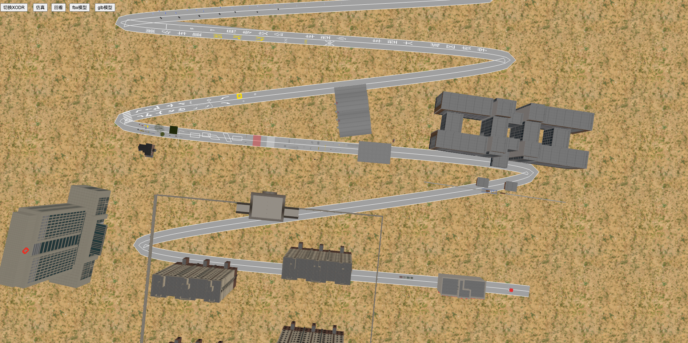

# Playground — Three.js 共享库示例应用

本目录为 **three-shared** 仓库的示例应用（Playground），用于演示各共享包在实际项目中的用法，便于集成与二次开发参考。

---

## 说明

Playground 基于 **Vue 3 + Vite + Three.js**，串联以下能力：

- **@threejs-shared/core-engine**：场景、相机、渲染器、控制器、光照、地面/天空（含 HDR）
- **@threejs-shared/xodr**：XODR 地图加载、解析与道路/标线/对象/信号渲染
- **@threejs-shared/wasm**：OpenDRIVE WASM 桥接，道路与隧道等数据
- **@threejs-shared/three-adapter-182**：Three.js r182 的 HDR 环境适配
- **@threejs-shared/protobuf**：Proto 与 WebSocket、仿真回放定时

通过本示例可快速查看引擎初始化、XODR 加载与渲染、仿真回放等完整流程。

---

## 运行方式

在仓库根目录安装依赖后，进入 playground 启动开发服务：

```bash
# 仓库根目录
pnpm install

cd playground
pnpm dev
```

构建与预览：

```bash
pnpm build
pnpm preview
```

---

## 渲染效果图

运行上述 `pnpm dev` 后，在浏览器中打开对应地址即可看到 3D 场景与 XODR 地图渲染效果。下方为示例效果图：



---

## 演示视频

- **观看方式**：点击下方链接，会在 GitHub 文件页中**直接在浏览器内播放**（需使用 **MP4** 格式；文件过大时可能仅提供下载）。
  - [观看演示视频](./overview/video.mp4)


---

## 与各包文档的对应关系

- 引擎与地面/天空：[core-engine.md](../docs/packages/core-engine.md)
- XODR 加载与渲染：[xodr.md](../docs/packages/xodr.md)
- WASM 与 OpenDRIVE：[wasm.md](../docs/packages/wasm.md)
- Proto 与回放：[protobuf.md](../docs/packages/protobuf.md)
- HDR 适配器：[adapters.md](../docs/packages/adapters.md)
